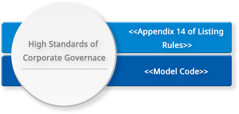

<!-- Welcome Banner -->


<!-- Task -->
<!-- Wrapper -->
<section class="wrapper style2 align-center" id = "task">
    

      <h2>Task</h2>
      <!--  -->

      

        <table>
          <thead>
            <tr>
              <th><h3>High Standards of Corporate Governance</h3></th>
            </tr>
          </thead>
          <tbody>
            <tr>
              <td>&lt;&lt;Appendix 14 of Listing Rules&gt;&gt;</td>
            </tr>
            <tr>
              <td>&lt;&lt;Model Code&gt;&gt;</td>
            </tr>
          </tbody>
        </table>
      

      

        <table>
          <thead>
            <tr>
              <th><h3>Onboard and Continuous Professional Development</h3></th>
            </tr>
          </thead>
          <tbody>
            <tr>
              <td>Orientation</td>
            </tr>
            <tr>
              <td>Continuous Professional Development</td>
            </tr>
            <tr>
              <td>Training</td>
            </tr>
          </tbody>
        </table>
      

      

        <table>
          <thead>
            <tr>
              <th><h3>Internal Control and Risk Management</h3></th>
            </tr>
          </thead>
          <tbody>
            <tr>
              <td>To maintain steady and effective internal control</td>
            </tr>
            <tr>
              <td>Proper response to the risk to prevent the assets from improperly used or loss</td>
            </tr>
          </tbody>
        </table>
      

      <ul class="actions vertical">
        <li></li>
      </ul>
    

</section>

<!-- Risk Management -->


<!-- Organizational Chart -->
<!-- We need to make an include to generate a table here -->
<section class="wrapper style2 align-left" id = "org_chart">
    

      <h2>Organizational Chart</h2>

      <ul>          
          <li>All committees under the board has written terms of reference</li>
          <li>The committees under the board could seek for independent professional advice in appropriate circumstances</li>
      </ul>

      

        <table>
        <thead>
            <tr>
                <td></td>
                <th bgcolor="{{ page.table_color.bg_col_header_1 }}" style="vertical-align : bottom;" class="align-center">Audit Committee</th>
                <th bgcolor="{{ page.table_color.bg_col_header_1 }}" style="vertical-align : bottom;" class="align-center">Remuneration Committee</th>
                <th bgcolor="{{ page.table_color.bg_col_header_1 }}" style="vertical-align : bottom;" class="align-center">Nomination Committee</th>
                <th bgcolor="{{ page.table_color.bg_col_header_1 }}" style="vertical-align : bottom;" class="align-center">Risk Management Committee</th>
                <th bgcolor="{{ page.table_color.bg_col_header_1 }}" style="vertical-align : bottom;" class="align-center">Environmental, Social and Governance Committee</th>
            </tr>
        </thead>
        <tr>
            <th scope="row" bgcolor="{{ page.table_color.bg_row_header }}">Mr. Ji Changqun</th>
            <td></td>
            <td></td>
            <td></td>
            <td></td>
            <td></td>
        </tr>
        <tr>
            <th scope="row" bgcolor="{{ page.table_color.bg_row_header }}">Ms. Du Wei</th>
            <td></td>
            <td></td>
            <td></td>
            <td></td>
            <td></td>
        </tr>        
         <tr>
            <th scope="row" bgcolor="{{ page.table_color.bg_row_header }}">Mr. Shen Chen</th>
            <td></td>
            <td></td>
            <td></td>
            <td></td>
            <td></td>
        </tr>
        <tr>
            <th scope="row" bgcolor="{{ page.table_color.bg_row_header }}">Mr. Ge Jinzhu</th>
            <td></td>
            <td></td>
            <td></td>
            <td></td>
            <td></td>
        </tr>
        <tr>
            <th scope="row" bgcolor="{{ page.table_color.bg_row_header }}">Mr. Lau Chi Keung</th>
            <td></td>
            <td></td>
            <td></td>
            <td></td>
            <td></td>
        </tr>
            
        <tr>
            <th scope="row" bgcolor="{{ page.table_color.bg_row_header }}">Mr. Tsang Sai Chung</th>
            <td></td>
            <td></td>
            <td></td>
            <td></td>
            <td></td>
        </tr>
        <tr>
            <th scope="row" bgcolor="{{ page.table_color.bg_row_header }}">Mr. Huang Shun</th>
            <td class="align-center"></td>
            <td></td>
            <td></td>
            <td></td>
            <td></td>
        </tr>    
        <tr>
            <th scope="row" bgcolor="{{ page.table_color.bg_row_header }}">Terms of Reference</th>
            <td><a href="../files/2_Terms-of-Reference-of-the-Audit-Committee-1.pdf" class="button fit small icon fas fa-download">PDF</a></td>
            <td><a href="../files/3_Term-of-Reference-of-the-Remuneration-Committee-1.pdf" class="button fit small icon fas fa-download">PDF</a></td>
            <td><a href="../files/NC-Terms-of-Reference-E.pdf" class="button fit small icon fas fa-download">PDF</a></td>
            <td><a href="../files/5_Terms-of-Reference-of-the-Risk-Management-Committee-1.pdf" class="button fit small icon fas fa-download">PDF</a></td>
            <td><a href="../files/Attachment-1_EN.pdf" class="button fit small icon fas fa-download">PDF</a></td>
        </tr>
    </table>
     
 - Chairperson&nbsp;&nbsp;&nbsp;&nbsp; - Member
 
      

      <ul class = "alt">
        <li>List of directors and their roles and functions  <a href="../files/ew_List-of-Director.pdf" class="icon style1 fas fa-download" style="color:{{ page.link_color }};"> PDF</a></li>
        <li>Memorandum of association & Articles of association  <a href="../files/6_Memorandum-of-Association-Articles-of-Association.pdf" class="icon style1 fas fa-download" style="color:{{ page.link_color }};"> PDF</a></li>
        <li>Procedures for Proposing a Person for Election as a Director  <a href="../files/7_Procedures-for-Proposing-a-Person-for-Election-as-a-Director.pdf" class="icon style1 fas fa-download" style="color:{{ page.link_color }};"> PDF</a></li>
        <li>Board Diversity Policy  <a href="../files/Board-Diversity-Policy-E.pdf" class="icon style1 fas fa-download" style="color:{{ page.link_color }};"> PDF</a></li>
        <li>Dividend Policy  <a href="../files/Dividend-Policy-E.pdf" class="icon style1 fas fa-download"> PDF</a></li>
		<li>Shareholders' Communication Policy  <a href="../files/股東通訊政策(英文)-(website).pdf" class="icon style1 fas fa-download"> PDF</a></li>
      </ul>

      <ul class="actions vertical">
        <li></li>
      </ul>
    

</section>
