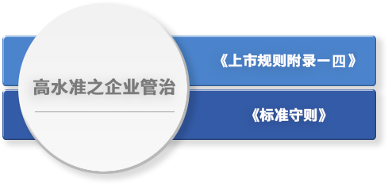

<!-- Welcome Banner -->


<!-- Task -->
<!-- Wrapper -->
<section class="wrapper style2 align-center" id = "task">
    

      <h2>任务</h2>
      <!--  -->

      

        <table>
          <thead>
            <tr>
              <th><h3>高水准之企业管治</h3></th>
            </tr>
          </thead>
          <tbody>
            <tr>
              <td>《上市规则附录十四》</td>
            </tr>
            <tr>
              <td>《标准守则》</td>
            </tr>
          </tbody>
        </table>
      

      

        <table>
          <thead>
            <tr>
              <th><h3>入职及持续专业发展</h3></th>
            </tr>
          </thead>
          <tbody>
            <tr>
              <td>提供迎新介绍</td>
            </tr>
            <tr>
              <td>持续专业发展</td>
            </tr>
            <tr>
              <td>专业单位培训</td>
            </tr>
          </tbody>
        </table>
      

      

        <table>
          <thead>
            <tr>
              <th><h3>内部监控及风险管理</h3></th>
            </tr>
          </thead>
          <tbody>
            <tr>
              <td>确保维持稳健及有效的内部监控</td>
            </tr>
            <tr>
              <td>对风险作出适当反应，以保障资产免遭不当使用或免受损失</td>
            </tr>
          </tbody>
        </table>
      

      <ul class="actions vertical">
        <li></li>
      </ul>
    

</section>

<!-- Risk Management -->


<!-- Organizational Chart -->
<!-- We need to make an include to generate a table here -->
<section class="wrapper style2 align-left" id = "org_chart">
    

      <h2>组织架构图</h2>

      <ul>
          <li>每个董事会辖下委员会的大多数成员为独立非执行董事</li>
          <li>本公司所有董事会辖下委员会均设有书面的职权范围</li>
          <li>董事会辖下委员会可在适当的情况下寻求独立专业意见</li>
      </ul>

      

      <table>
        <thead>
            <tr>
                <td></td>
                <th bgcolor="{{ page.table_color.bg_col_header_1 }}" style="vertical-align : bottom;" class="align-center">审核委员会</th>
                <th bgcolor="{{ page.table_color.bg_col_header_1 }}" style="vertical-align : bottom;" class="align-center">薪酬委员会</th>
                <th bgcolor="{{ page.table_color.bg_col_header_1 }}" style="vertical-align : bottom;" class="align-center">提名委员会</th>
                <th bgcolor="{{ page.table_color.bg_col_header_1 }}" style="vertical-align : bottom;" class="align-center">风险管理委员会</th>
                <th bgcolor="{{ page.table_color.bg_col_header_1 }}" style="vertical-align : bottom;" class="align-center">环境、社会及管治委员会</th>
            </tr>
        </thead>
        <tr>
            <th scope="row" bgcolor="{{ page.table_color.bg_row_header }}">季昌群先生</th>
            <td></td>
            <td></td>
            <td></td>
            <td></td>
            <td></td>
        </tr>
         <tr>
            <th scope="row" bgcolor="{{ page.table_color.bg_row_header }}">杜玮女士</th>
            <td></td>
            <td></td>
            <td></td>
            <td></td>
            <td></td>
        </tr>
         <tr>
            <th scope="row" bgcolor="{{ page.table_color.bg_row_header }}">沈晨先生</th>
            <td></td>
            <td></td>
            <td></td>
            <td></td>
            <td></td>
        </tr>
        <tr>
            <th scope="row" bgcolor="{{ page.table_color.bg_row_header }}">刘智强先生</th>
            <td></td>
            <td></td>
            <td></td>
            <td></td>
            <td></td>
        </tr>
        <tr>
            <th scope="row" bgcolor="{{ page.table_color.bg_row_header }}">邹小磊先生</th>
            <td class="align-center"></td>
            <td></td>
            <td></td>
            <td></td>
            <td></td>
        </tr>
        <tr>
            <th scope="row" bgcolor="{{ page.table_color.bg_row_header }}">曾细忠先生</th>
            <td></td>
            <td></td>
            <td></td>
            <td></td>
            <td></td>
        </tr>
        <tr>
            <th scope="row" bgcolor="{{ page.table_color.bg_row_header }}">职权范围</th>
            <td><a href="../files/2_審核委員會職權範圍.pdf" class="button fit small icon fas fa-download">PDF</a></td>
            <td><a href="../files/3_薪酬委員會職權範圍.pdf" class="button fit small icon fas fa-download">PDF</a></td>
            <td><a href="../files/NC-Terms-of-Reference-C.pdf" class="button fit small icon fas fa-download">PDF</a></td>
            <td><a href="../files/5_風險管理委員會之職權範圍.pdf" class="button fit small icon fas fa-download">PDF</a></td>
            <td><a href="../files/Attachment-1_CN.pdf" class="button fit small icon fas fa-download">PDF</a></td>
        </tr>
    </table>
     
 - 主席&nbsp;&nbsp;&nbsp;&nbsp; - 成员
 
      

      <ul class = "alt">
        <li>董事名单与其角色和职能  
        <a href="../files/Attachment-2_CN.pdf" class="icon style1 fas fa-download" style="color:{{ page.link_color }};"> PDF</a></li>
        <li>公司章程细则  
        <a href="../files/6_組織章程大綱及新公司細則.pdf" class="icon style1 fas fa-download" style="color:{{ page.link_color }};"> PDF</a></li>
        <li>股东提名个别人士为本公司董事之程序  <a href="../files/7_提名人士參選董事之程序.pdf" class="icon style1 fas fa-download" style="color:{{ page.link_color }};"> PDF</a></li>
        <li>董事会成员多元化政策  
        <a href="../files/Board-Diversity-Policy-C.pdf" class="icon style1 fas fa-download" style="color:{{ page.link_color }};"> PDF</a></li>
        <li>股息政策  
        <a href="../files/Dividend-Policy-C.pdf" class="icon style1 fas fa-download"> PDF</a></li>
      </ul>

      <ul class="actions vertical">
        <li></li>
      </ul>
    

</section>

